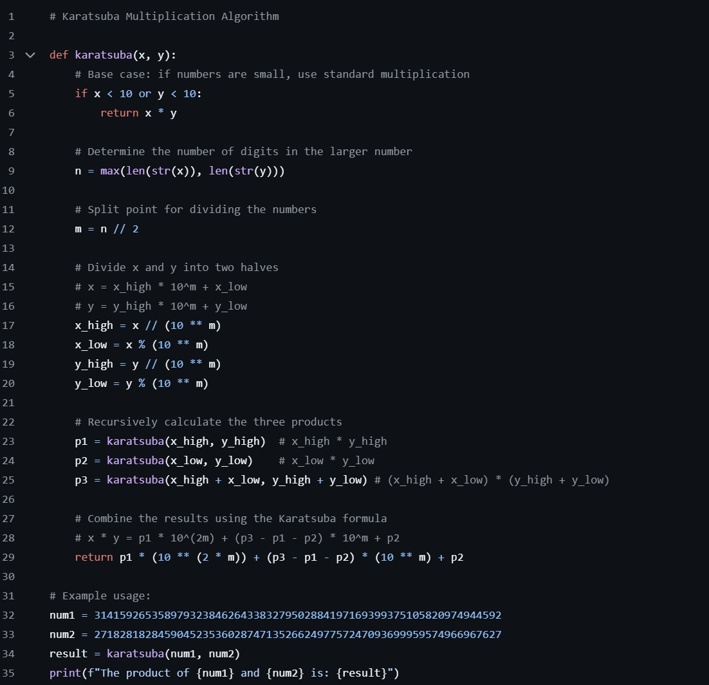
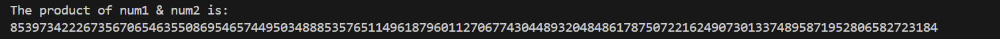

# Karatsuba-Multiplication-Algorithm
A high-performance divide-and-conquer algorithm for multiplying large integers.

The Karatsuba algorithm multiplies two numbers faster than classical grade-school multiplication.
Instead of the usual O(n²) time, Karatsuba runs in: 
## O(nlog2 8) ≈ O(n1.585)

It achieves this by splitting numbers into halves and reducing the number of required multiplications from 3 → 2.

### Python Algorithm:

### Output:

